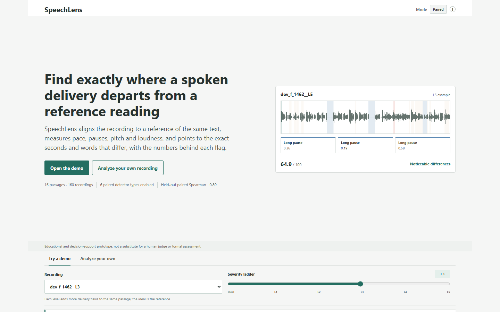
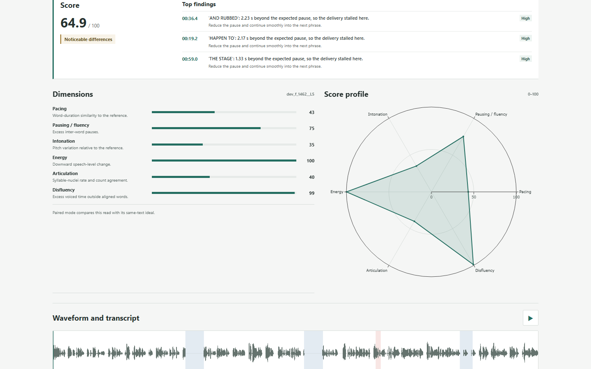
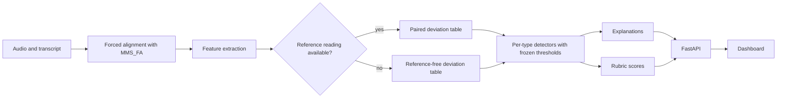
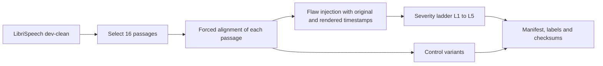

# SpeechLens

[](https://github.com/srishtipandey1/speechlens/actions/workflows/tests.yml)

Contrastive speech analytics: compare a spoken delivery with a reference reading of the same text, and get the seconds, words and measurements where the two differ. Built for the Multimodal AI Hackathon 2026, Track C.





## Overview

A speech judge has to weigh pace, pauses, pitch variation and loudness at the same time, and the feedback they give is usually vague. SpeechLens takes a recording and its transcript, aligns the words to the audio, extracts acoustic features, and reports regions where the delivery departs from a baseline. Each region comes with a start and end time, the words involved, the measured value, the expected value, and a plain sentence that uses those numbers. Scores and explanations come from fixed formulas. No language model is involved anywhere in the scoring path.

There are two modes. Paired mode compares the recording with a reference reading of the same text, which is the more reliable setting. Reference-free mode has no reference reading and compares the recording with statistics collected from ideal readings in our development split. It supports fewer flaw types, because several measurements only mean something relative to a specific reading (see Limitations).

The system is an educational and decision-support prototype. It does not replace a human judge.

## Architecture



Features are computed on a 10 ms frame grid and normalized per recording (F0 in semitones relative to the speaker's own median, energy in dB relative to the median), so the comparison does not depend on the speaker's pitch or microphone level. The formulas are in `docs/FEATURES.md`, the detection rules in `docs/DETECTION.md`, and the scoring rubric in `docs/RUBRIC.md`.

## Dataset

We built a contrastive dataset from LibriSpeech dev-clean. Sixteen passages of 60 to 85 seconds were selected, one per speaker (8 male, 8 female), and split into 8 development and 8 test passages with no speaker in both. Each passage is the ideal reading. From it we generate:

- Five flawed versions (levels L1 to L5) by injecting pace changes, long pauses, flattened pitch, volume drop-off, filler sounds and repeated words, at severities 0.2, 0.35, 0.5, 0.7 and 0.9.
- Four control versions with no injected flaw: an identity pass through the same resynthesis, an MP3 round trip, a gain change of 6 dB, and added noise at about 30 dB SNR. These measure how often the detectors fire on changes that should not count as flaws.

That gives 160 recordings: 16 ideal, 80 injected and 64 controls, about 177.5 minutes of audio. Every injected flaw carries ground-truth start and end times in two timelines: the original timeline of the ideal reading, and the rendered timeline of the modified audio. Time-stretching and inserted pauses shift later words, so both are stored. Labels, the manifest and SHA-256 checksums are in `data/labels/`. Construction details and caveats are in `docs/DATASHEET.md`; the label schema is in `docs/LABEL_SCHEMA.md`.



Dataset download: DATASET_LINK_TODO

To check a download, compare it with `data/labels/checksums.sha256`. The audio is stored as 24-bit FLAC. The 16-bit format flattened the quiet room tone we use to fill inserted pauses into digital silence, which a detector could have found trivially.

## Setup

Windows PowerShell:

```powershell
python -m venv .venv
.\.venv\Scripts\Activate.ps1
python run.py setup
python run.py test
```

Linux or macOS:

```bash
python3 -m venv .venv
source .venv/bin/activate
python run.py setup
python run.py test
```

`python run.py setup` installs the CPU build of PyTorch first, then the pinned dependencies. The first alignment run downloads the MMS_FA model (about 1 GB) into the torch cache.

To run the dashboard on the precomputed demo (one passage, ideal plus L1 to L5 plus two controls):

```bash
python run.py precompute_demo
python run.py serve
```

Then open http://127.0.0.1:8000/. The demo needs the dataset audio in `data/processed/` (see Dataset). Uploading your own recording needs the MMS_FA weights.

Tests that need the dataset or model weights skip themselves when those are missing. With `CI=true`, the slow tests are deselected, which is what the GitHub workflow does.

### Docker

A CPU-only `Dockerfile` is included. It has not been verified end to end against the full demo; treat it as a starting point. The container does not contain the dataset or the alignment weights. Mount `data/processed/demo` and `data/processed/audio` for the demo tab, and mount a torch cache directory that already holds the MMS_FA weights if the container has no network.

```bash
docker build -t speechlens .
docker run --rm -p 8000:8000 speechlens
```

## Reproducing the results

```bash
python run.py dataset       # build the dataset (writes data/processed and data/labels)
python run.py eval          # development split: tune thresholds, write eval/results/*
python run.py eval_test     # held-out test split, once, with frozen thresholds
python run.py score_eval    # rubric scores versus severity, dev and test
```

`eval` writes `config/detection.yaml` and its checksum to `eval/results/frozen_config.sha256`. `eval_test` refuses to run if the config no longer matches that checksum. Run `python run.py --help` for the full task list. Copies of the small result files are in `docs/results/`.

The order mattered. Thresholds were tuned on the development split only. The test split was then evaluated once with the frozen config, and the scoring weights were fixed before test scores were computed.

## Results

Detection, region-level F1 at IoU 0.3. Test numbers use frozen thresholds on speakers that never appeared in development.

| Mode | Dev F1 | Test F1 | Test 95% CI | Test boundary error | Test false regions per minute |
|---|---:|---:|---|---:|---:|
| Paired | 0.464 | 0.383 | 0.311 to 0.453 | 256.3 ms | 1.05 |
| Reference-free | 0.282 | 0.278 | 0.236 to 0.331 | 59.4 ms | 0.11 |

Per flaw type on the test split (precision, recall, F1 at IoU 0.3):

| Type | Paired | Reference-free |
|---|---|---|
| Long pause | 1.00 / 0.65 / 0.79 | 0.57 / 0.52 / 0.55 |
| Filler | 0.92 / 0.52 / 0.67 | 0.87 / 0.62 / 0.72 |
| Fast pace | 0.54 / 0.39 / 0.45 | disabled |
| Monotone | 0.27 / 0.46 / 0.34 | disabled |
| Slow pace | 0.10 / 0.55 / 0.17 | disabled |
| Volume drop-off | 0.07 / 0.15 / 0.10 | disabled |
| Repeated words | disabled | disabled |

False regions per minute on the test split, with no flaw present in the audio:

| Mode | Ideal | Identity | MP3 | Gain 6 dB | Noise |
|---|---:|---:|---:|---:|---:|
| Paired | 0.00 | 1.26 | 0.46 | 3.09 | 0.46 |
| Reference-free | 0.11 | 0.11 | 0.11 | 0.11 | 0.11 |

Rubric score against severity (Spearman correlation of the total score with severity level 0 to 5, with 95% bootstrap CI over passages):

| Mode | Dev | Test |
|---|---|---|
| Paired | -0.90 (-0.95 to -0.86) | -0.89 (-0.94 to -0.84) |
| Reference-free | -0.34 (-0.65 to -0.21) | -0.64 (-0.74 to -0.47) |

Paired mode separates ideal from flawed recordings with AUC 1.00 on both splits. Treat that number with care: in paired mode the ideal is compared with itself, so a perfect separation is partly built in. The Spearman correlation across five severity levels is the more informative figure. Reference-free AUC is 0.64 on dev and 0.69 on test.

Paired F1 is lower on test than on dev, and the combined false-region rate on test (1.05 per minute) is slightly above the budget of 1 per minute that held on dev (0.21). The full tables are in `docs/results/` and `eval/results/`.

### What went wrong along the way

Our first detection results used word timings read from the dataset's label files. Those timings already contained the injected filler words and repeated words, so the detector was reading part of the answer. Dev F1 of 0.533 (paired) and 0.263 (reference-free) from that run are in `eval/results/detection_legacy_before.csv` and should not be quoted. After switching to forced alignment on the audio alone, the first honest run gave F1 of 0.046 and 0.023 with 53 to 124 false regions per minute. Debugging the score columns on the development split found real measurement faults (a pace normalization that cancelled the stretch it should have detected, a dead zone in the pitch measure, and a filler score that never ran in paired mode). Fixing those and allocating the false-region budget per mode gave the numbers above.

## Evaluation criteria

| Criterion | Where it is implemented | Evidence |
|---|---|---|
| Data engineering and stress testing | `scripts/build_passages.py`, `scripts/make_dataset.py`, `scripts/validate_dataset.py`, `src/speechlens/injection/`; tests in `test_injection.py`, `test_dataset_builder.py`, `test_validate_dataset.py` | `docs/DATASHEET.md`, `data/labels/manifest.csv`, `data/labels/checksums.sha256`, control-variant false-region rates |
| Temporal grounding and causal explanation | `src/speechlens/detection/`, `src/speechlens/explain/`; tests in `test_detection.py` | `docs/DETECTION.md`, `docs/results/test_detection_*.csv` |
| Feature extraction | `src/speechlens/features/`, `docs/FEATURES.md`; tests in `test_features.py` | `scripts/check_normalization.py`, `scripts/check_feature_deltas.py` |
| Visualization and dashboard | `frontend/`, `src/speechlens/api/` | `docs/images/`, `test_api.py` |
| Reproducibility and code quality | `run.py`, `config/`, `.github/workflows/tests.yml`, frozen config checksum | CI badge above, `docs/results/frozen_config.sha256` |

## Limitations

- **Disabled detectors.** Reference-free mode keeps only long pause and filler. Fast pace, slow pace, monotone and volume drop-off were disabled there because no threshold met the false-region budget with a development F1 of at least 0.15. Repeated-word detection is disabled in both modes: it needs a speech recognizer, which we left out of scope.
- **Weak paired detectors.** Slow pace, monotone and volume drop-off have low precision on the test split. The dashboard marks their regions as low reliability and hides them by default.
- **Loudness changes.** A gain change of 6 dB produced 3.09 false regions per minute in paired mode.
- **Timing accuracy.** Paired boundary error is about 256 ms, so region edges are approximate.
- **Reference needed.** Paired mode needs a reference reading of the same text.
- **Synthetic flaws.** The flawed recordings are generated by signal processing. The filler is built from the speaker's own voiced audio, PSOLA can leave audible artifacts, and we did not validate on real flawed human speech. The ideal readings are volunteer audiobook readings, not professional orators.
- **Reproducibility.** Praat's PSOLA resynthesis is not bit-identical between runs and has no exposed seed. The dataset builder caches its output (`.speechlens_cache/`), which makes repeated builds on one machine identical, but a fresh build on another machine may differ in the last bits.
- **Small sample.** There are 16 speakers. Confidence intervals are wide and the dev-to-test gap should be read with that in mind.

## Project layout

```
src/speechlens/   alignment, features, injection, detection, scoring, explain, api
scripts/          dataset construction, validation and evaluation scripts
config/           dataset, injection, feature and (frozen) detection settings
data/labels/      manifest, per-recording labels, checksums
frontend/         static dashboard
docs/             datasheet, feature, detection and rubric notes, result copies
eval/results/     evaluation output (mostly git-ignored; copies in docs/results/)
tests/            unit and integration tests
```

## Licenses and citation

The source code is released under the MIT License (`LICENSE`). The dataset derives from LibriSpeech and is released under CC BY 4.0 with attribution (`DATA_LICENSE.md`).

Two dependencies carry terms you should know about. Parselmouth (the Python interface to Praat) is licensed under GPLv3, so a distributed environment or container image that bundles it carries GPL obligations for that component. The MMS forced-alignment model weights loaded through torchaudio are licensed CC BY-NC 4.0, so the system as configured is for research and education, not commercial use. Other dependency licenses are listed in `docs/THIRD_PARTY.md`.

If you use this work, cite it with `CITATION.cff` and cite LibriSpeech:

> V. Panayotov, G. Chen, D. Povey and S. Khudanpur, "LibriSpeech: an ASR corpus based on public domain audio books," ICASSP 2015.

Plotly.js (MIT) is bundled in `frontend/vendor/`. The alignment model comes from torchaudio's MMS_FA pipeline.
